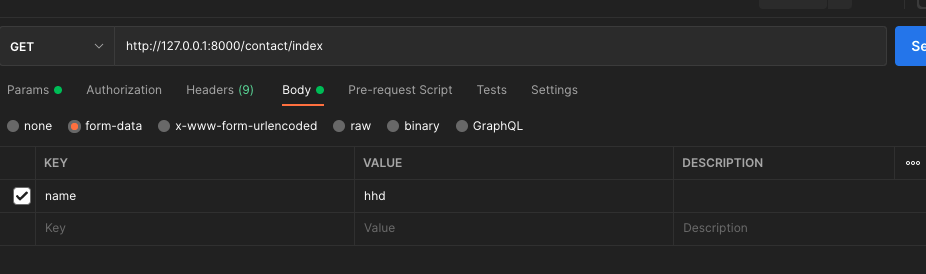
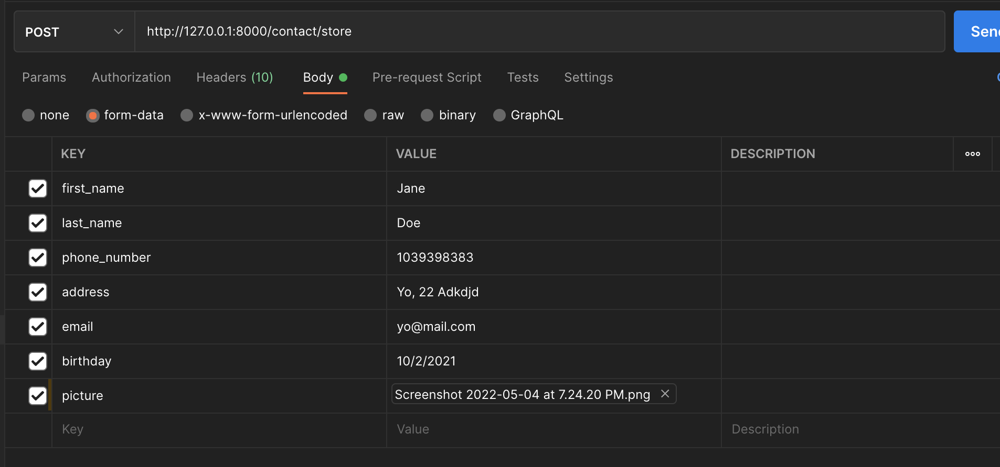
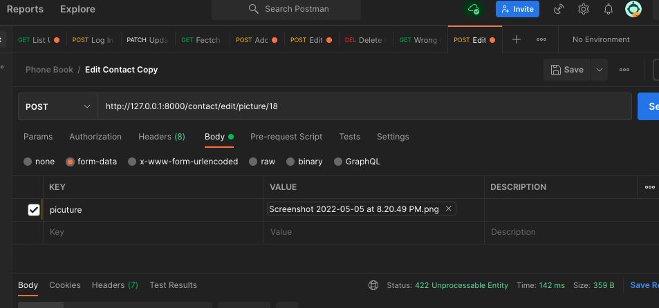

# Phone Book (API)

## Documentation

Create an application based on phone book. The application should have the following

- Add other customers as contact.
- Edit created contacts.
- Delete existing contacts
- Search for contacts by name

Each contact will need the following information:
- First name
- Last name
- Address information
- Phone number
- Birthday
- email address
- Picture (optional)

## Technologies

- PHP 8.1
- Symfony
- Mysql or Postgresql or Sqlite

## How to run the application
Below are the steps you need to successfully set up and run the application.

- Clone the app from the repository and cd into the root directory of the app
```
$ composer install
$ cp .env.example .env
$ php bin/console doctrine:database:create
$ php bin/console make:migration
$ php bin/console doctrine:migrations:migrate
$ symfony server:start
```

## Running Test

```shell script
$ php bin/console --env=test doctrine:database:create
$ php bin/console --env=test doctrine:schema:create
$ php bin/phpunit
```

---

## Api Documentation

---
#### Below are the routes included in the project.

- Method: GET
- URL : `http://127.0.0.1:8000/contacts`
- URL : `http://127.0.0.1:8000/contact/index?name=request_name`. Request name search for the name user you to search.
- Notice: Also Image below is to search for a name is a contact
  
  
  
---
- Method: POST 
- URL: `http://127.0.0.1:8000/contact/store`

- #### Sending data through postman form-data and image can be attached using the form only

    


##### Sending data through raw with json and picture doesn't only in this part:
```
    {
        "first_name": "Jane",
        "last_name": "Doe",
        "address": "Frankfurt am Main, Hessen",
        "phone_number": "1039398383",
        "birthday": "10/2/2021",
        "email": "doe@gmalillydoo.com"
    }
```

---

- Method: PUT
- DELETE:  `http://127.0.0.1:8000/contact/edit/1`


#### Quick Notice: Image are not allowed to be sent through this form. The frontend dev can also send only required attribute he/she intends to change only
example

- Body:
```
    {
        "first_name": "Lilly",
    }
```
### This is for sending all required attributes he/she intend to change
- Body:
```
    {
        "first_name": "Lilly",
        "last_name": "Doe",
        "address": "Frankfurt am Main, Hessen",
        "phone_number": "1039398383",
        "birthday": "10/2/2021",
        "email": "doe@gmalillydoo.com"
    }
```

#### This method required you to change picture with a `POST` request only 
- Method: POST
- URL: `http://127.0.0.1:8000/contact/edit/picture/18`


  

- Method: DELETE
- URL: `http://127.0.0.1:8000/contact/delete/1`

---